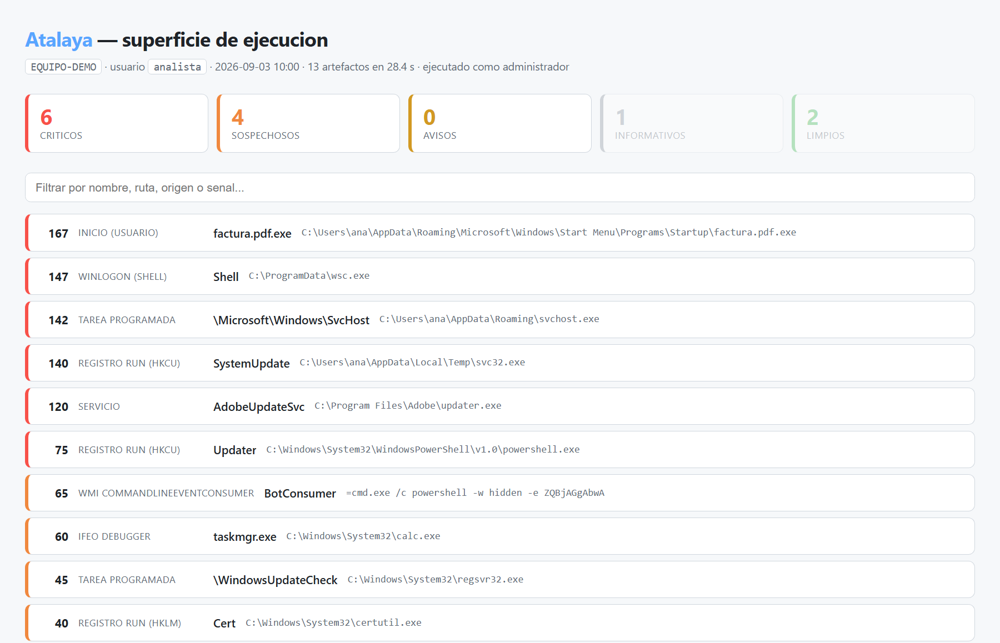
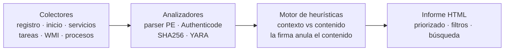

# Atalaya

**Auditoría forense de la superficie de ejecución de Windows.** Enumera *todo lo que
puede ejecutarse solo* en una máquina, analiza cada binario y emite un informe
priorizado y navegable.

<sub>🇬🇧 **On-demand forensic audit of the Windows execution surface.** Atalaya enumerates
every autostart mechanism, analyzes each binary (own PE parser, entropy, Authenticode,
SHA256) and produces a prioritized, self-contained HTML report. Built to do Autoruns +
VirusTotal better — and in Spanish.</sub>

[](https://github.com/FranSOC-1/atalaya/actions/workflows/tests.yml)


No es un antivirus. No tiene protección residente, ni driver de kernel, ni feed
de firmas. Es la herramienta que usa un técnico cuando le traen un PC y necesita
responder en dos minutos a *«¿qué se ejecuta aquí y por qué?»*.



<sub>Informe de ejemplo generado con los datos sintéticos del banco de pruebas
(`python docs/generar_captura.py`). Ninguna captura contiene datos de una máquina real.</sub>

```bash
python atalaya.py
```

---

## Qué hace

**Recolecta** la superficie de persistencia completa:

| Fuente | Detalle |
|---|---|
| Registro | `Run`/`RunOnce` (HKLM, HKCU, vistas 64 y 32 bits), políticas de Explorer |
| Valores críticos | `Winlogon` (Shell, Userinit, Taskman), `AppInit_DLLs`, `BootExecute`, `AppCertDlls`, scripts de logon |
| IFEO | Depuradores enganchados a binarios concretos |
| BHO | Componentes cargados por el motor de navegación heredado |
| Carpetas de inicio | Usuario y máquina, resolviendo el destino real de los `.lnk` |
| Servicios y drivers | Leídos del registro, con tipo y modo de arranque |
| Tareas programadas | Todas las acciones ejecutables de cada tarea activa |
| WMI | `__EventFilter`, `CommandLineEventConsumer`, `ActiveScriptEventConsumer` |
| Procesos vivos | Agrupados por ejecutable |

**Analiza** cada binario encontrado:

- **Firma Authenticode** por lotes, con la misma cadena de confianza que aplica Windows al ejecutarlo.
- **Parser PE propio** (sin dependencias): secciones, entropía por sección, tabla de importaciones completa, mitigaciones (ASLR/DEP/CFG), timestamp de compilación.
- **SHA256** de cada fichero único.
- **YARA** opcional, con reglas propias de comportamiento en `reglas/atalaya.yar`.

**Puntúa** con ~18 heurísticas y emite un informe HTML autocontenido con filtros
por nivel, búsqueda global y toda la evidencia desplegable por artefacto.

---

## El problema real: los falsos positivos

Es la parte donde mueren estos proyectos, y la razón de la decisión de diseño
central de Atalaya.

La primera versión marcó **`explorer.exe` como crítico**. Y con razón aparente:
importa `VirtualAllocEx` + `WriteProcessMemory` + `CreateRemoteThread`, engancha
el teclado y detecta depuradores. También lo hacen Chrome, Steam, Spotify, y
todos los antivirus del mercado. Un informe donde `explorer.exe` sale en rojo no
es un informe: es ruido con formato.

Atalaya separa las señales en dos categorías:

- **Contexto** — dónde vive el binario, cómo arranca, qué ordena ejecutar.
  Cuenta siempre, esté firmado o no. Un ejecutable firmado que persiste desde
  `%TEMP%` sigue mereciendo una mirada.
- **Contenido** — qué hay dentro del PE. Describe **capacidades, no intenciones**.

Con una firma válida, las señales de contenido se atenúan:

| Situación | Factor | Efecto |
|---|---|---|
| Firma válida de Microsoft | ×0 | Contenido anulado |
| Firma válida de tercero | ×0,2 | Contenido atenuado |
| Paquete MSIX/AppX | ×0,2 | Firma a nivel de contenedor, no por fichero |
| Sin firma válida | ×1 | Cuenta entero |

Además, con editor identificado las señales de contenido **no se suman, se toma
la mayor**: quien inyecta código suele además detectar depuradores y traer
secciones empaquetadas. Es un perfil de capacidades, no cuatro pruebas
independientes.

Resultado sobre este equipo: de **2 críticos y 48 avisos falsos** a **0 hallazgos**,
sin perder ni una detección del banco de pruebas.

📄 **La historia completa, con el código, la correlación por máximo y los números:**
[Diseño de la detección — de 48 falsos positivos a cero](docs/diseno-deteccion.md).

---

## Verificación

```bash
python pruebas/banco.py
```

13 casos sintéticos que reproducen técnicas reales, sin tocar el sistema:

| Caso | Resultado |
|---|---|
| Ejecutable en `%TEMP%` con persistencia y UPX | 140 pts · crítico |
| `svchost.exe` falso fuera de System32 | 142 pts · crítico |
| PowerShell con carga base64 en el arranque | 75 pts · crítico |
| Binario legítimo troyanizado (`HashMismatch`) | 120 pts · crítico |
| Secuestro de `Winlogon\Shell` | 147 pts · crítico |
| Doble extensión `.pdf.exe` en Inicio | 167 pts · crítico |
| Squiblydoo (`regsvr32 /i:http`) | 45 pts · sospechoso |
| Persistencia por suscripción WMI | 65 pts · sospechoso |
| IFEO enganchado a `taskmgr.exe` | 60 pts · sospechoso |
| `certutil -urlcache` descargando carga | 40 pts · sospechoso |
| **Control negativo:** `explorer.exe` de Microsoft | 0 pts · limpio |
| **Control negativo:** servicio firmado en Program Files | 8 pts · info |
| **Control negativo:** Defender en `ProgramData\Microsoft\...` | 0 pts · limpio |

Los controles negativos son tan importantes como las detecciones: un motor que
solo se prueba contra malware siempre parece funcionar.

---

## Uso

```bash
python atalaya.py                        # escaneo completo (~30 s, 800+ artefactos)
python atalaya.py --rapido               # solo inventario, sin firmas ni PE (~2 s)
python atalaya.py --sin-procesos         # omite procesos vivos
python atalaya.py --salida C:\informes\equipo-cliente.html
python atalaya.py --json informe.json    # volcado para procesar
python atalaya.py --sin-yara             # desactiva YARA
python atalaya.py --top 30               # hallazgos en consola
```

Código de salida `1` si hay algún hallazgo crítico — encadenable en scripts.

**Ejecuta como administrador** para cobertura completa: sin privilegios quedan
fuera las suscripciones WMI, algunas tareas programadas y los procesos
protegidos del sistema. El informe avisa cuando la vista es parcial.

### Instalación

Solo requiere **Python 3.11+** y Windows. Cero dependencias obligatorias.

```bash
pip install yara-python      # opcional, activa el motor de reglas
```

---

## Arquitectura

Una tubería en cuatro etapas: recolectar la superficie de persistencia, analizar
cada binario, puntuar con el motor de heurísticas y emitir el informe.



## Estructura

```
atalaya.py                  orquestador y CLI
nucleo/
  modelos.py                Artefacto, Senal, Nivel, Informe
  util.py                   hashes, entropía, resolución de rutas, puente PowerShell
colectores/
  persistencia.py           registro, inicio, servicios, tareas, WMI, procesos
analizadores/
  pe.py                     parser PE propio (cabeceras, secciones, imports)
  firma.py                  Authenticode por lotes
  yara_motor.py             integración opcional con YARA
reglas/
  heuristicas.py            motor de puntuación (~18 reglas)
  atalaya.yar               reglas YARA de comportamiento
informe/
  html.py                   informe autocontenido, claro y oscuro
pruebas/
  banco.py                  13 casos sintéticos + controles negativos
```

Añadir una regla es una función decorada que devuelve `Senal`:

```python
@regla
def mi_regla(a: Artefacto):
    if condicion:
        return [Senal("CODIGO", "Titulo", "Explicacion", 30, "contenido")]
    return []
```

---

## Límites conocidos

Son deliberados, no pendientes:

- **No detecta malware sin fichero ni inyecciones en memoria.** Un implante que
  vive dentro de un proceso legítimo no deja rastro en disco ni en la
  persistencia. Eso requiere telemetría en tiempo real (ETW) o un driver.
- **No hay protección residente.** Atalaya audita bajo demanda; no bloquea nada.
- **No hay inteligencia de amenazas.** Sin feeds de reputación, un binario
  desconocido y firmado pasa como limpio.
- **Las heurísticas describen capacidades.** Un aviso significa «esto merece una
  mirada», nunca «esto es malware».
- **Sin lista blanca por hash.** No hay corpus de binarios buenos conocidos, así
  que la firma digital hace todo el trabajo de supresión.

---

## Hoja de ruta

**Fase 1 — utilidad para el técnico**
- Cuarentena y remediación: matar proceso, aislar fichero cifrado, limpiar la entrada de persistencia
- Reputación por hash contra MalwareBazaar (abuse.ch, API pública)
- Export a PDF del informe para entregar al cliente
- Comparación entre dos escaneos: qué ha cambiado desde la última visita

**Fase 2 — visibilidad en tiempo real**
- Telemetría vía ETW en modo usuario: creación de procesos, cargas de módulo, conexiones
- Árbol de procesos con linaje (quién lanzó qué)
- Detección de patrones de ejecución, no solo de artefactos en disco

**Fase 3 — producto**
- Empaquetado en un `.exe` único (PyInstaller) firmado con certificado de código
- Consola central para gestionar varios equipos de clientes
- Modelo: herramienta interna primero, servicio de auditoría después, producto al final

El orden importa. Competir de frente con Malwarebytes requiere driver de kernel
firmado por Microsoft, corpus de listas blancas y un equipo de analistas. Ese
camino está cerrado para un desarrollador solo. El hueco real está en la
auditoría forense: responder *qué se ejecuta aquí* mejor y más rápido que
Autoruns, y en español.
